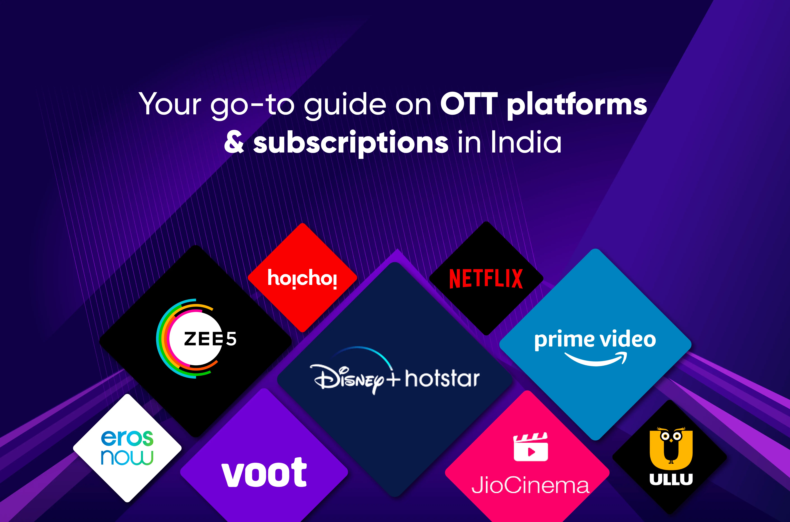
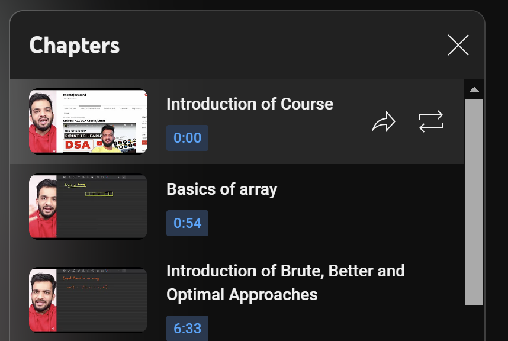

# Algorithmic problem solving portfolio
 - **Course Name:** Algorithmic Problem Solving
 - **Course Code:** 23ECSE309
 - **Name:** Amogh Shrikant Dodawad
 - **University:** KLE Technological University, Hubballi-31

---

# Overview
This portfolio explores and analyses the functionalities provided by OTT platforms along with the algorithms used to implement the respective funtionalities along with their time and space efficiency.

---

# Table of contents
1. [Introduction](#introduction)
2. [Objectives](#objectives)
3. [System design](#system-design)
4. [Functionalities](#functionalities)
5. [Efficiency analysis](#efficiency-analysis)
6. [References](#references)

---

# Introduction
OTT platforms have been some of the most revolutionary services that received a huge attention and users with the rise of internet. The un-matched flexibility provided by the OTT platforms ensured that they became very popular in very less time, hence, the scale, which is good from a business PoV, but, is a rather difficult task when looked at from a engineering PoV, became a critical thing to handle. Thus making sure that right components are used in the right manner are critical to ensuring the scalabilty in service offerings. 

One of the main components to achieve the scale efficiently as mentioned above are the algorithms that are used to design these services/functionalities. At the core, any code that is implementing a certain business logic like streaming, analytics, payments etc. are all well-defined algorithms. Thus it is extremely critical that right algorithms and data structures as they are the core of any tech-business service.

In this portfolio, we take a deeper look at how algorithms play an important role in smooth functioning of an OTT service.

---

# Objectives
- Explore new algorithms in field of OTT streaming services.
- Suggest suitable algorithms and design techniques.
- Suggest improvements, modifications to the existing algorithms.
- Try and implement video-streaming applications, that includes trancoding etc.

---

# System Design
- The key users in this system are:
    1. **Watcher:** The person who is consuming the video streams.
    2. **Content creators / Uploaders:** The people who are sharing their content.
    3. **The platform providers:** This refers to the organisation that is providing the OTT services.
- Architecture of the system:
    - The system would be microservices architcture as there are many independent service offerings like streaming, uploading, transcoding etc.
    - As the system is a distributed one, we would need orchestrators and proxies to ensure smoothing functioning of the system.
    - There would also be a pub-sub mechanism for an effective inter-service communication.
    - The upload service is responsible for accepting the uploads by the content creators.
    - The transcoding service picks up the uploaded video and transcodes it into multiple resolutions and formats like MPEG-DASH or HLS.
    - The streaming service is responsible for streaming the video whenever requested by any user.
- Process / walk-through:
    - Initially a content-creator uploads a video to the platform through upload service.
    - Upon completion of the upload, the upload service notifies the transcoding service to start the transcoding.
    - Upon receiving this message, the video is transcoded into multiple resolutions in either MPEG-DASH or HLS format etc.
    - Upon the completion of this phase, the video is now ready to be consumed.
    - Whenever the user requests for the video, it is delivered to him/her via the streaming service.

---

# Functionalities
1. **Adaptive bitrate streaming**
    
    - ABR refers to the process of making streaming available in multiple video/audio resolutions to choose from and optionally, switching between multiple resolutions based on the user's available bandwidth.
    - **Data structure**: Data structures like [queues](https://github.com/amoghdodawad/aps-portfolio/blob/main/codes/queues.cpp) can be used for buffering, etc.
    - **Algorithms**: Few of the popular ABR algorithms/protocols are MPEG-DASH, HLS etc.

    

2. **Typeahead search**
    - Typeahead search refers to the functionality where the user types a part of the query he/she is intending to search and the potential list of completed queries is prompted back to the user to choose from.
    - **Data structure**: [Trie](https://github.com/amoghdodawad/aps-portfolio/blob/main/codes/trie.cpp) is a popular data structure to perform operations on dictionary like functionalities.
    - **Algorithms**: Trie can be used in conjuction with algorithms like [BFS](https://github.com/amoghdodawad/aps-portfolio/blob/main/codes/bfs.cpp), [DFS](https://github.com/amoghdodawad/aps-portfolio/blob/main/codes/dfs.cpp) to find the k-nearest words.

    

3. **Timestamps / Chapters**
    - Timestamps/chapters are the key-moments in a video where an important subject is being streamed. Allowing users to skip directly to the timestamps results in saving huge amount of bandwidth and time.
    - **Data structure**: Linear data structures like array, [queues](https://github.com/amoghdodawad/aps-portfolio/blob/main/codes/queues.cpp) would be used here.
    - **Algorithms**: Algorithms like [max-sum sliding-window](https://github.com/amoghdodawad/aps-portfolio/blob/main/codes/slidingWindow.cpp) would help in identifying the key moments in the video. Caching those results using data structures like hash-tables will greatly reduce the latency.

    

4. **Most-watched / Most-replayed**
    - This features enables users to look at the most viewed segments in a given video. This is a constantly changing parameter as the watch time of individual user keeps on changing as per their requirements over a range of time.
    - This is more useful to the content creator as they can retrospect on their content and watch-behaviour of their users.
    - **Data structure / Algorithm**: Data structures like [Fenwick trees](https://github.com/amoghdodawad/aps-portfolio/blob/main/codes/fenwickTree.cpp), [Segment trees](https://github.com/amoghdodawad/aps-portfolio/blob/main/codes/rangeUpdateQuery.cpp) can optimise the process of generating this analytics they are better suited for range updates.
5. **Personalised recommendation system**
    - This feature enables users to get recommendations based on their watch history and the preferences as suggested by the user himself/herself.
    - **Data structure / Algorithm**: Machine learning algorithms/techniques like deep learning, NLP etc. can be used to effectively generate the personalised feed for each user.
6. **Multi-parameter filtering**
    - This feature enables users to filter the content based on multiple parameters like genre, language, year etc.
    - **Data structure**: Data structures like [BST, B-trees](https://github.com/amoghdodawad/aps-portfolio/blob/main/codes/btree.cpp) help in effectively filtering the content.
    - **Algorithm**: Algorithms like [Union-find](https://github.com/amoghdodawad/aps-portfolio/blob/main/codes/unionFind.cpp) help in identifying the similar filters to ones provided by the user.
7. **Pagination**
    - This feature enables user to view top-k suggestions in their personalised feed at a time.
    - This is highly important for the server and the database as well, as querying and processing a large chunk of data is highly resource intensive.
    - **Data structure / Algorithm**: Data structures like [heaps](https://github.com/amoghdodawad/aps-portfolio/blob/main/codes/heapify.cpp) are highly efficient in sorting out of the top-k elements.

---

# Efficiency analysis

|---------------------------------------|------------------------------------------------|-----------------------------------------------|
| **Algorithm**                         | **Time Complexity**                            | **Space Complexity**                          |
|---------------------------------------|------------------------------------------------|-----------------------------------------------|
| **Fenwick Trees**                     | Creation: O(n log n), Update/Query: O(log n)   | O(n)                                          |
| **Dijkstra's Algorithm**              | O((V + E) log V)                               | O(V^2)                                        |
| **Heap Data Structure**               | Insert/Delete/Extract: O(log n)                | O(n)                                          |
| **Trie Data Structure**               | Insert/Search: O(n)                            | O(n) each node                                |
| **B Trees**                           | Insert/Delete/Search: O(log n)                 | O(n)                                          |
| **Segment Trees**                     | Creation: O(n log n), Query/Update: O(log n)   | O(n)                                          |
| **Hash Tables**                       | Insert/Delete/Search: theta(1), O(n)           | O(n)                                          |
| **BFS and DFS**                       | O(V + E)                                       | O(V)                                          |
| **Topological Sort**                  | O(V + E)                                       | O(V)                                          |
| **Binary Search Tree**                | Insert/Delete/Search: theta(log n), O(n)       | O(n)                                          |
| **Kruskal's Algorithm**               | O(E log E)                                     | O(E + V)                                      |
| **Union-Find**                        | Union/Find: O(α(n))                            | O(n)                                          |
|---------------------------------------|------------------------------------------------|-----------------------------------------------|

---

# References
[1]  "Adaptive Bitrate Streaming (ABR): What is it & How Does it Work?", Andy Francis, Bitmovin, 2023. Available: [https://bitmovin.com/adaptive-streaming](https://bitmovin.com/adaptive-streaming)

[2]  "Design Typeahead (Autocomplete) System", System Design School, 2023. Available: [https://systemdesignschool.io/problems/typeahead/solution](https://systemdesignschool.io/problems/typeahead/solution)

[3]  "Knutt-Moris-Pratt algorithm", Taneesha Mathur, Scaler, 2024. Available: [https://www.scaler.com/topics/data-structures/kmp-algorithm/](https://www.scaler.com/topics/data-structures/kmp-algorithm/)

[4]  "Fast forward moving picture experts group", FFmpeg, 2024. Available: [https://ffmpeg.org/](https://ffmpeg.org/)

[5]  "How Streaming Services Use Algorithms", Arts and technology management group, 2021. Available: [https://amt-lab.org/blog/2021/8/algorithms-in-streaming-services](https://amt-lab.org/blog/2021/8/algorithms-in-streaming-services)